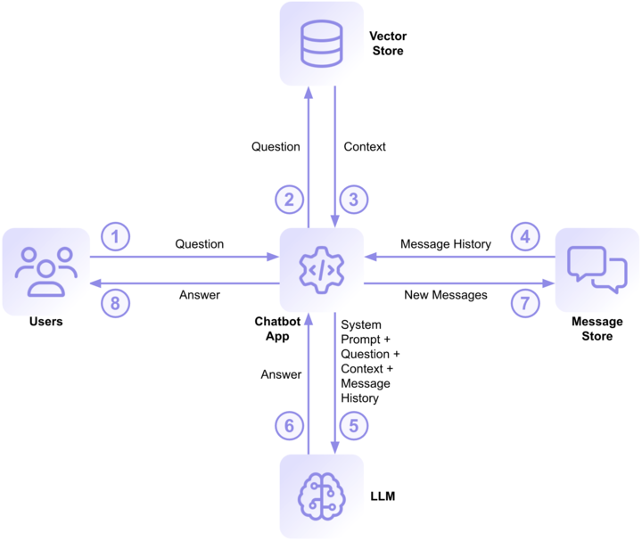

# kommitly_backend

## Tasks to do

Remove reminder time and sent from ai task
Check how to reduce response time for render or other alternatives
Write tests
Work on subscription plan
Work on integrations

# RAG Basics

Retrieval-Augmented Generation, or RAG for short, is a technique that applies the generative features of an LLM to a collection of documents, resulting in a chatbot that can effectively answer questions based on the content of those documents.

A typical RAG implementation splits each document in the collection into several roughly equal-sized, overlapping chunks and generates an embedding for each chunk. Embeddings are vectors (lists) of floating-point numbers with hundreds or thousands of dimensions. The distance between two vectors indicates their similarity. Small distances indicate high similarity, and large distances indicate low similarity.

The RAG app then loads each chunk, along with its embedding, into a vector store. The vector store is a special-purpose database that can perform a similarity search — given a piece of text, the vector store can retrieve chunks ranked by their similarity to the query text by comparing the embeddings.



Given a question from the user (1), the RAG app can query the vector store for chunks of text that are similar to the question (2). Those chunks form the context that helps the LLM answer the user’s question. Here’s what that looks like using the documentation collection as an example: given the question, “Tell me about object lock”, the vector store returns four document chunks, each of about 170 words, to the app (3). Here is a link to the text of, and a short extract from, each chunk:

- Object Lock: With Object Lock Legal Hold, files are prevented from being changed or deleted; however, immutability does not have a defined retention period.
- Object Lock: You can enable Object Lock on a bucket when you create a new bucket or on an existing bucket.
- Object Lock: Object Lock was designed with the Immutability feature in Veeam Backup & Replication in mind.
- Enable Object Lock with the S3-Compatible API: To enable Object Lock on an existing S3-compatible bucket, add the x-amz-bucket-object-lock-token header with a value of 1 to the S3 Put Object Lock Configuration API call.

Unsurprisingly, three of the four results are extracts from the main documentation article on object lock.

In order to provide a conversational experience, the RAG app maintains a chat history in a message store. The RAG app retrieves the message history (4) to form part of the query it will send to the LLM. Steps 2 and 4, retrieving data from the vector and message stores, can be performed concurrently, since neither depends on the other.

A system prompt sets the guidelines for the LLM to generate responses. In a RAG, the system prompt typically specifies that the response should be based on retrieved document data rather than model memorization and attempts to prevent hallucinations by ensuring that the model does not fabricate information if no relevant documents are found. Here is the system prompt from the RAG app:

```

Use the following pieces of context and the message history to answer the question at the end. If you don't know the answer, just say that you don't know; don't try to make up an answer.

```

The RAG submits the system prompt, the context, the last few messages in the conversation, and the user’s question to the LLM (5), which generates a, hopefully, helpful response (6). Here’s the answer it provided to the above question:

Object Lock is a feature that allows users to enforce immutability on files stored in cloud storage. Here are the key points about Object Lock:

1. Immutability: Once a file is locked, it cannot be modified or deleted until a specified retention period expires or a legal hold is lifted.
2. Retention Periods: Users can set a retention period when locking a file. During this time, the file remains immutable, meaning it cannot be changed or deleted.
3. Legal Hold: Users can place files under a legal hold, which prevents modifications or deletions indefinitely until the hold is removed.
4. Enabling Object Lock: Object Lock can be enabled for new buckets or existing ones, but it must be turned on at the bucket level before files are uploaded.
5. Integrations: Some applications, such as Veeam Backup and Replication, offer built-in support for Object Lock, making the process easier for users who want to ensure file immutability during backups.
6. No Extra Cost: There is no additional fee for using Object Lock; however, standard storage charges still apply for the locked files.
7. Mistakes in Locking: If a user locks a file for longer than intended, they may need to contact support to resolve the situation, which could involve closing their storage account in some cases.
   Overall, Object Lock is a crucial feature for organizations that need to ensure data integrity and compliance with regulations concerning data retention.

The RAG app adds the user’s question and the LLM’s response to the message store (7), returns the answer to the user (8), and awaits the next question.
